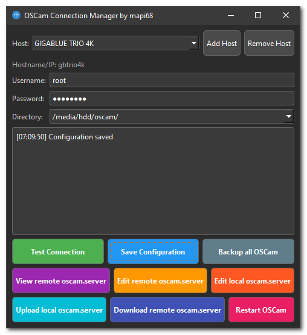

# OSCam Connection Manager

[](https://github.com/mapi68/oscam-connection-manager/blob/master/LICENSE)
[](https://github.com/mapi68/oscam-connection-manager)
[](https://github.com/mapi68/oscam-connection-manager/releases)
[](https://github.com/mapi68/oscam-connection-manager/releases)
[](https://github.com/mapi68/oscam-connection-manager/commits/master)
[](https://github.com/mapi68/oscam-connection-manager/releases)

A PyQt6-based GUI application that simplifies managing OSCam server configurations across multiple hosts. Features include remote configuration editing, manual backup capabilities, and FTP-based transfers with a modern dark-themed interface.



## Features

- **Multi-Host Management**: 
  - Add and manage multiple OSCam server hosts
  - Quick switching between different hosts
  - Save and load host configurations

- **Configuration Management**:
  - View remote oscam.server configurations
  - Edit local and remote oscam.server files
  - Upload/Download configuration files

- **Backup System**:
  - Manual backup of complete OSCam configuration
  - Timestamped backups for each host
  - Organized backup directory structure

- **Connection Features**:
  - FTP-based connection
  - Connection testing functionality
  - Configurable connection parameters
  - Support for various OSCam installation directories

- **Other Features**:
  - Remote OSCam restart capability via web interface
  - Real-time operation logging
  - Dark mode UI for better visibility

## Installation

### Windows Users (Recommended)
1. Download the pre-built Windows 64-bit release from the GitHub releases page
2. Extract the archive to your preferred location
3. Run the executable directly - no additional installation required

### From Source
1. Ensure you have Python 3.6+ installed
2. Install required dependencies:
```bash
pip install PyQt6 requests configparser
```

3. Run the application:
```bash
python oscam_connection_manager.py
```

## Configuration

The application stores its configuration in `oscam_connection_manager.conf`. This file is automatically created and managed by the application.

Supported OSCam directories:
- /etc/tuxbox/config/
- /etc/tuxbox/config/oscam/
- /etc/tuxbox/config/oscam-emu/
- /hdd/oscam/
- /hdd/oscam-emu/
- And many more...

## Usage

### Adding a New Host

1. Click "Add Host"
2. Enter display name and hostname/IP
3. Configure username (default: root) and password
4. Select the appropriate OSCam directory
5. Test the connection

### Managing Configurations

- **View Configuration**: Click "View remote oscam.server" to inspect the current configuration
- **Edit Configuration**: 
  - Use "Edit remote oscam.server" for direct remote editing
  - Use "Edit local oscam.server" for offline editing
- **Transfer**: 
  - "Upload local oscam.server" to push local changes
  - "Download remote oscam.server" to fetch remote configuration

### Backup Management

1. Select the host you want to backup
2. Click "Backup all OSCam"
3. Backups are stored in `oscam_backups/<hostname>/backup_<timestamp>/`

## Technical Details

- **Framework**: PyQt6
- **Network Protocol**: FTP
- **Configuration Format**: INI-style configuration file
- **Backup System**: Timestamped directory structure
- **UI Theme**: Dark mode with custom styling

## Requirements

### For Windows 64-bit Release
- Windows 7/8/10/11 64-bit
- No additional requirements - all dependencies are included

### For Source Installation
- Python 3.6+
- PyQt6
- requests
- configparser
- ftplib (standard library)
- Internet connection for remote operations

## License

This project is licensed under the GNU General Public License v3.0 - see the [LICENSE](LICENSE) file for details.

## Acknowledgments

Created by mapi68

---

*Note: This tool is designed for managing OSCam servers and requires appropriate access permissions to the remote servers.*
